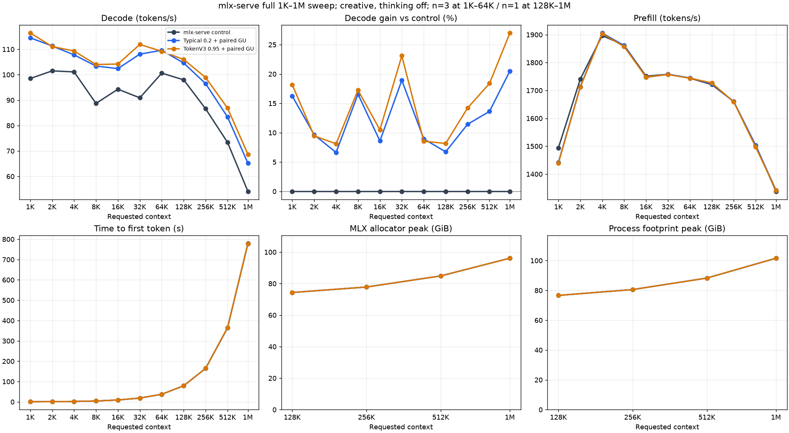
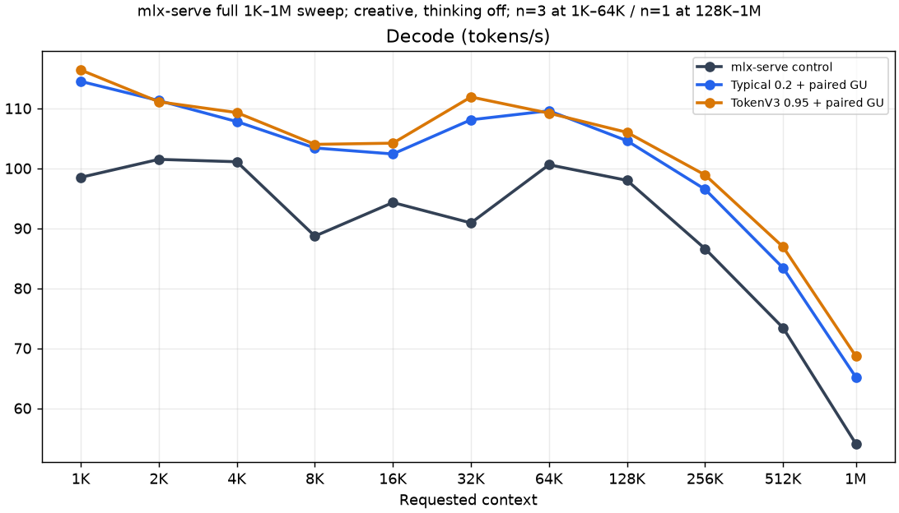
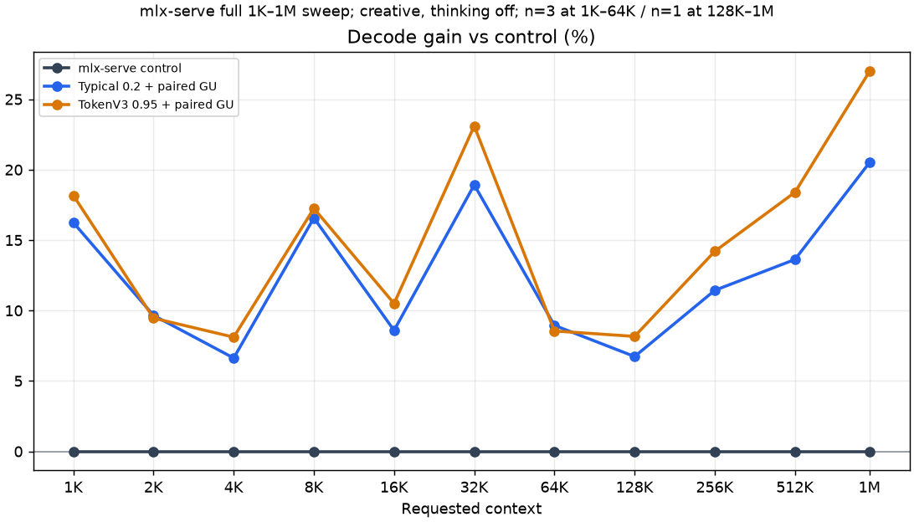
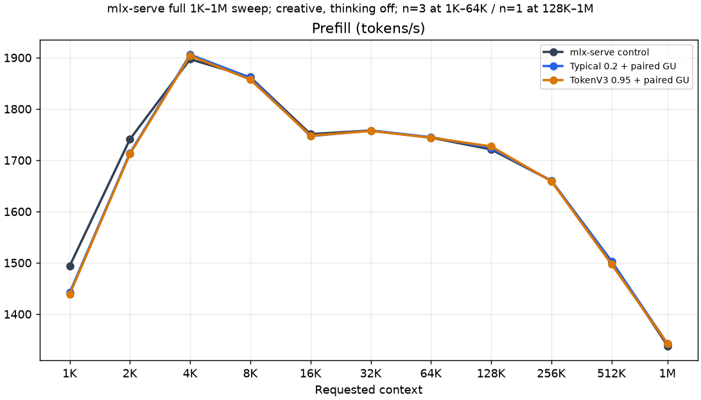
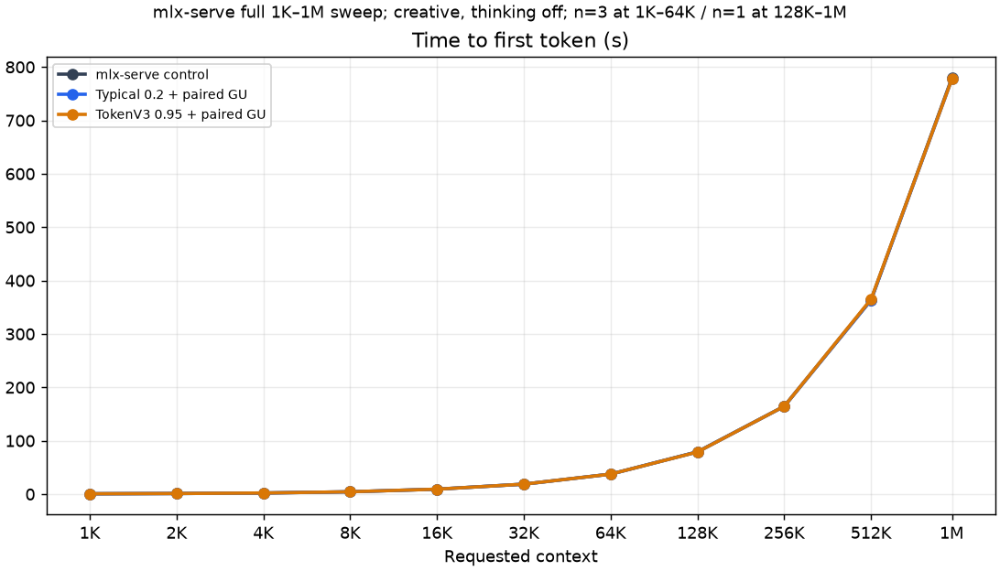
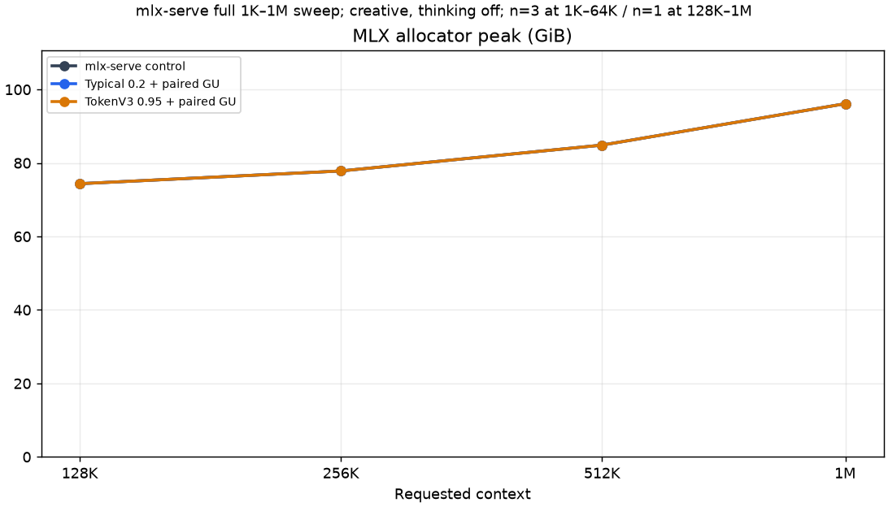
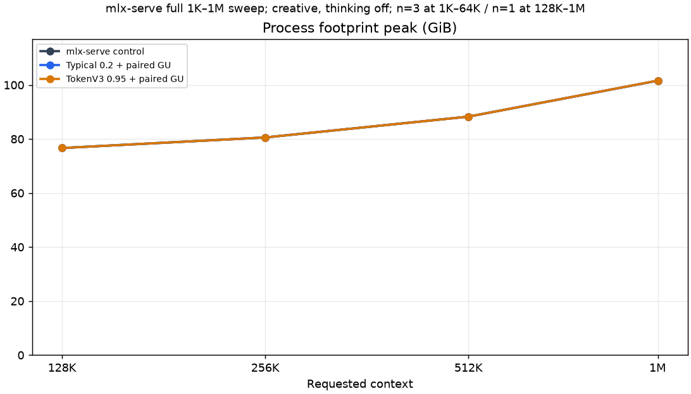

# Qwen3.8 Flash-Next sampled-MTP port: benchmark record

This directory records the measurements used to review the Qwen3.8
Flash-Next work from issue #419. The comparison has three mlx-serve arms:

1. an unchanged upstream control using the exact MTP verifier;
2. Typical acceptance at `0.2` plus the paired routed gate/up kernel; and
3. TokenV3 acceptance at `0.95` plus the same paired kernel.

The candidate arms are the complete PR configurations. They also include the
request-local sampled-MTP RNG fix, so their gains must not be attributed to the
verifier or kernel in isolation.

## Matched serving configuration

All three arms used the same `ddalcu/Qwen3.8-Flash-Next-MLX-Serve-mixed-4-8bit`
pack and these settings:

- Apple M5 Max with 128 GiB unified memory;
- 8-bit KV cache;
- MTP forced to depth 3;
- sampled drafts (`MLX_SERVE_MTP_DRAFT_GREEDY=0`);
- temperature 1, top-p 0.95, and top-k 20;
- thinking explicitly disabled;
- prefix caching disabled; and
- maximum fan speed, with each model run serialized by the machine's exclusive
  GPU guard.

The control source tree was unchanged upstream main at tree
`c5c57f9c0fa939c36f0c91d3eb7c1591e943964e`. Both candidate arms used PR
#427 at tree `52d50c57a66839991c09808e300b45a572e1f658`. The model configuration
SHA-256 was
`fe0b5952857299b31d75bedf1d8897faea14b4116a04c73a73152361e7788f59`.
The llmprobe request sequence, prompt bodies, token caps, and wire seeds were
matched between arms. No autoregressive MTPLX samples are included.

The 1K-64K points are medians of three coding requests per arm and rung. The
128K-1M points are one request per arm and rung, intended to establish timing
and memory scale rather than an uncertainty interval. `results.json` contains
all 33 plotted rows.

## Decode result

| Requested context | Actual input | Control | Typical + kernel | Gain | TokenV3 + kernel | Gain |
| ---: | ---: | ---: | ---: | ---: | ---: | ---: |
| 1K | 1,035 | 98.5 | 114.5 | +16.2% | 116.4 | +18.2% |
| 2K | 2,048 | 101.5 | 111.3 | +9.7% | 111.1 | +9.5% |
| 4K | 4,088 | 101.1 | 107.8 | +6.6% | 109.3 | +8.1% |
| 8K | 8,258 | 88.7 | 103.4 | +16.6% | 104.0 | +17.2% |
| 16K | 16,295 | 94.3 | 102.4 | +8.6% | 104.2 | +10.5% |
| 32K | 32,885 | 90.9 | 108.1 | +18.9% | 111.9 | +23.1% |
| 64K | 65,446 | 100.6 | 109.6 | +8.9% | 109.2 | +8.5% |
| 128K | 136,358 | 98.0 | 104.6 | +6.7% | 106.0 | +8.2% |
| 256K | 273,113 | 86.6 | 96.5 | +11.4% | 98.9 | +14.2% |
| 512K | 546,701 | 73.4 | 83.4 | +13.6% | 86.9 | +18.4% |
| 1M | 1,043,375 | 54.1 | 65.2 | +20.5% | 68.7 | +27.0% |

At 16K, all nine timed requests generated 192 tokens with no cached input.
Median full-request wall time was 11.332 seconds for control, 11.190 for
Typical, and 11.157 for TokenV3. Prefill accounts for roughly 9.3 seconds of
that request, so the decode gains reduce total wall time by only 1.3-1.5% at
this short output length.

## Prefill, TTFT, and memory

Prefill is effectively unchanged between arms. At 1M, llmprobe produced
1,043,375 actual input tokens and 192 output tokens. TTFT was 779.6 seconds for
control, 777.5 for Typical, and 777.8 for TokenV3. The larger decode delta has
little effect on the end-to-end request because prefill dominates.

The high-context memory samples are process-lifetime peaks across the complete
llmprobe run. At 1M, the MLX allocator peak was 96.13 GiB and process
`phys_footprint_peak` was about 101.6 GiB in every arm. These describe different
scopes and must not be added. The 1M run used an operator-set 116 GiB macOS GPU
wired limit and an 8 GiB admission reserve against a 106 GiB projected peak.

The model's native context limit is 262,144 tokens. The 128K point uses native
RoPE. The 256K, 512K, and 1M points use a YaRN factor-4 override, so they are a
different RoPE configuration. These long-context points report timing and
memory only; they do not establish long-context answer quality or recurrent
state parity.

## Kernel-only A/B

The paired q4/group-64 routed gate/up kernel was isolated on one binary with
exact acceptance. Two boot orders and three matched 16K/1,024-token requests
per order measured:

| Arm | Mean decode | Total wall time |
| --- | ---: | ---: |
| Existing sorted gate/up gathers | 70.377 tok/s | 109.077 s |
| Paired gate/up kernel | 70.914 tok/s | 108.675 s |
| Difference | **+0.76%** | **-0.37%** |

All six pairs matched completion length, answer digest, and reasoning digest.
This result assigns less than one percentage point to the kernel. The wider
three-arm gains measure the verifier, RNG fix, and kernel together.

## Quality sanity screen

One llmprobe 0.6.7 creative, thinking-off JavaScript code pass used the same
pack and serving settings:

| Arm | HumanEval-JS | MBPP-JS | Total | Request errors |
| --- | ---: | ---: | ---: | ---: |
| Unchanged exact control | 45/50 | 34/50 | **79/100** | 0 |
| Typical + kernel | 45/50 | 33/50 | **78/100** | 0 |
| TokenV3 + kernel | 45/50 | 32/50 | **77/100** | 0 |

This is a single sampled pass@1 sanity screen. It is not a quality-equivalence
claim, and it is not the separate 164-task Python HumanEval suite.

## Additional charts

- [Full-request wall time](wall_s.png)
- [Completion-token counts](completion_tokens.png)
- [Machine-readable result rows](results.json)
